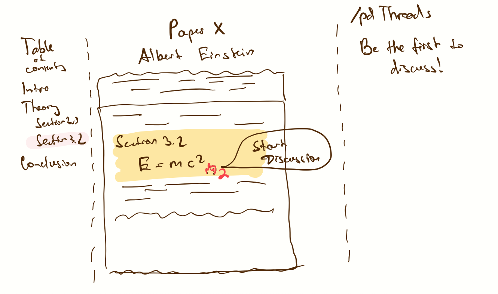
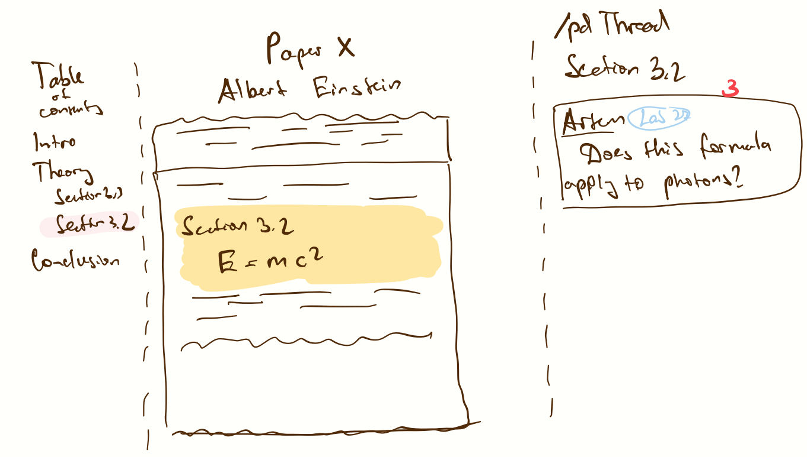
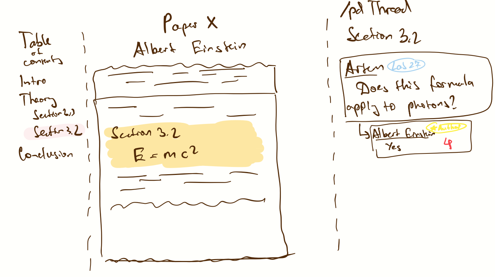
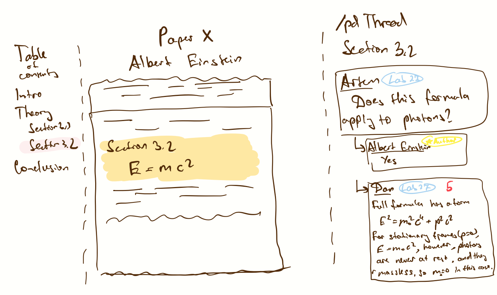

# Functional Design
# Project: Paper Discussion Platform

## Roadmap
- [Problem Statement](#final-project-problem-framing-problem-statement)
- [Concept Design](#concept-design)
- [User Journey](#user-journey)
- [UI Sketches](#ui-sketches)
- [Visual Design Study](#visual-design-study)
- [Design Summary](#design-summary)
- [Development Plan](#development-plan)
- [Risks & Mitigations](#risks--mitigations)
- [Value Sensitive Design (Ethical) Study](#value-sensitive-design-ethical-study)

---

## Final Project Problem Framing: Problem Statement

### Domain

**Academic research communication & collaboration.**
We follow research communities where discourse around new papers is fragmented across Slack threads, hard-to-accepted-in conferences, X/Twitter, YouTube comments, and other forums. We care about making this engagement more liquid: easier to find, join, and reference, so that feedback, error‑finding, and idea exchange happen earlier and more often.

### Problem

**Fragmented, low‑signal discussion for specific papers.**
For any given paper, relevant discussion is scattered and hard to locate. Lab‑intreernal thads are invisible to outsiders; social media is hype‑driven and ephemeral; YouTube comments are diffuse and not anchored to precise parts of the paper, top-tier conferences have a small capacity of papers they can accept. This raises the cost of asking good questions, surfacing corrections, and building on others' insights.

### Stakeholders

* **Authors (researchers)** — benefit from targeted feedback, errata discovery, new suggestions, and clarifications tied to specific passages/figures.
* **Engaged readers (students/early‑career researchers)** — need a place to ask scoped questions and see authoritative answers.
* **General technical audience** — can contribute applied perspectives; currently excluded by lab silos.
* **Moderators/maintainers** — keep discourse high‑signal and civil with light‑weight tools.

### Evidence & Comparables 

We use the evidence we found since the assignment 1:

Our main evidence is our personal experience and our researcher friends' experiences. However, this problem is acknowledged, which can be seen by many discussions on reddit and forums about common ways to engage in paper discussions. More sources are below:

- [Academia StackExchange: Is there a good site for holding online discussions of scientific papers?](https://academia.stackexchange.com/questions/2385/is-there-a-good-site-for-holding-online-discussions-of-scientific-papers) — multiple users note there is no centralized, widely adopted platform.
- [r/academia thread: Is there a forum where people can discuss academic papers?](https://www.reddit.com/r/academia/comments/1czi7dt/is_there_a_forum_where_people_can_discuss/) — discussions mostly happen in small labs or fragmented spaces.
- [r/academia comment (example)](https://www.reddit.com/r/academia/comments/1czi7dt/comment/l5gnlik/) — lab-level discussions are ad hoc and rarely accessible to outsiders.
- [alphaXiv announcement (Stanford AI Lab)](https://x.com/StanfordAILab/status/1818669016325800216) — interest in tools that help summarize and share arXiv papers.
- [PubPeer](https://pubpeer.com/) — post-publication peer review exists, but adoption is niche.
- [ResearchGate Q&A](https://www.researchgate.net/questions) — paper discussions exist, but engagement quality is often criticized.
- [X/Twitter search: arXiv paper discussion](https://x.com/search?q=arxiv%20paper%20discussion&src=typed_query) — popular, hype-driven threads; decent reach, poor depth.
- [Nature editorial: The future of peer review](https://communities.springernature.com/posts/the-future-of-peer-review) — recognizes gaps in post-publication discourse.
- [LSE Impact blog: Why we need to talk about academic peer review](https://blogs.lse.ac.uk/impactofsocialsciences/2016/02/17/breaking-the-traditional-mould-of-peer-review/) — existing tools do not incentivize serious engagement.

List of Comparables:

1. **PubPeer** — niche adoption for post‑publication review; demonstrates value of per‑paper threads but lacks broad, anchored discussion.
2. **ResearchGate Q&A** — general forum with mixed engagement quality; signals demand for discussion features.
3. **X/Twitter paper threads** — high reach but low structure; discovery decays quickly; limited depth.
4. **alphaXiv/summary tools** — interest in better paper discovery & summaries; adjacent but not a discussion venue.
5. **Lab Slack 'paper‑dump' channels** — common, but private and ad‑hoc; threads are not discoverable by field.
6. **Papiers (papiers.ai)** – redesigned arXiv interface with AI summaries, wiki‑style breakdowns, lineage graphs, mind maps, and live social context (swap arxiv → papiers on any paper URL). Focuses on reading and discovery, not anchored discussion. Complementary to PubDiscuss: can deep‑link from Papiers to a canonical per‑paper pub by DOI/arXiv.
7. **YouTube explainer comments** — activity exists but comments are detached from paper sections/figures and spread across duplicate videos.

---

## Application Pitch 

**Name**: **PubDiscuss** (per‑paper '**pub**' for anchored **discussion**)

**Motivation**: Finding and joining serious discussion for *this* paper is hard; PubDiscuss creates a canonical, anchored discussion space keyed by DOI/arXiv where authors and readers meet.

**Possible features**

1. **Discussion Pubs (per DOI/arXiv)** — Every paper gets a canonical home. Why it helps: eliminates fragmentation; one link to share. Impact: authors and readers converge; moderators have one venue to maintain.
2. **Inline Anchors & Highlighted Threads** — Comments attach to a section/figure/line range. Why it helps: precise context, less talking past each other, easier error‑finding. Impact: authors resolve specific misconceptions; readers learn faster.
3. **Verified Identity Badges (ORCID/affiliation)** — Optional ORCID or institutional email yields badges (Author, Affiliation). Why it helps: establishes trust without doxxing. Impact: readers can triage expert replies; authors gain visibility.
4. **Upvoting** — per‑thread and per‑reply upvotes (no downvotes). Why it helps: quickly surfaces high‑signal answers/explanations. Impact: default sort favors helpful anchored content; authors/mods can still pin.
5. **Wide range of reply content** — Link to other papers/posts, embed images, and render LaTeX math. Why it helps: enables precise derivations and evidence‑backed answers. Impact: higher‑quality anchored threads; reusable explanations.
6. **Cross‑paper linking** — Reference anchors in other papers and show backlinks. Why it helps: connects related proofs/results. Impact: builds a navigable graph of anchored discussions across the literature.
7. **AI‑augmented search** — Semantic and citation‑aware search across pubs and linked papers. Why it helps: finds related anchors/explanations beyond keywords. Impact: faster discovery of answers and prior work.

---
# Concept Design
## Concept: DiscussionPub[User, Anchor]

+ **purpose** per-paper forum with threads and replies, anchored to some context
+ **principle** pub is created for a paper to be discussed; threads are created by the
users of the paper in relation to some context, replies are created by the users in
relation to a thread
+ **state**
  + a set of Pubs with
    + a paperId String
    + a createdAt Date
  + a set of Threads with
    + an author User
    + a pub Pub
    + an anchor Anchor
    + a title String
    + a body String
    + a deleted Boolean
    + a createdAt Date
    + an editedAt Date?
  + a set of Replies with
    + a thread Thread
    + an author User
    + an anchor Anchor
    + a body String
    + a deleted Boolean
    + a createdAt Date
    + a parent Reply?
    + an editedAt Date?
+ **actions**
  + open(paperId: String) : (newPub: Pub)
    + **requires** there is no pub with the given paperId in the set of Pubs +
    + **effects** inserts a new pub with the given paperId and current timestamp into
    the set of Pubs and returns it
  + startThread(pub: Pub, author: User, anchor: Anchor, title: String, body: String) :
  (newThread: Thread)
    + **requires** the pub is in the set of Pubs
    + **effects** inserts a new thread with the given pub, author, anchor, title, body,
    current timestamp, deleted flag set to false and editedAt set to null and returns it
  + editThread(thread: Thread, newTitle: String, newBody: String) : ()
    + **requires** the thread is in the set of Threads
    + **effects** updates the title and body of the thread with the new values and
    sets the editedAt to current timestamp
  + deleteThread(thread: Thread) : ()
    + **requires** the thread is in the set of Threads
    + **effects** sets the deleted flag of the thread to true and sets the editedAt to
    current timestamp
  + makeReply(thread: Thread, author: User, anchor: Anchor, body: String, parentReply?: Reply) : (newReply: Reply)
    + **requires** the thread is in the set of Threads; the parentReply, if provided,
    should be in the set of Replies and the thread of the parentReply should be the
    same as the thread.
    + **effects** inserts a new reply with the given thread, author, anchor, body,
    current timestamp, deleted flag set to false, and editedAt set to null into the
    set of Replies and returns it. If a parentReply is provided, it is set as the
    parent of the new reply.
  + editReply(reply: Reply, newBody: String) : ()
    + **requires** the reply is in the set of Replies
    + **effects** updates the body of the reply with the new value and sets the
    editedAt to the current timestamp
  + deleteReply(reply: Reply) : ()
    + **requires** the reply is in the set of Replies
    + **effects** sets the deleted flag of the reply to true and sets the editedAt to
    current timestamp

## Concept: HighlightedContext

+ **concept** HighlightedContext [Highlight, User]
+ **purpose** store regions of papers (lines, figures, sections) highlighted by users
as well as the parent context in which the region is highlighted
+ **principle** the user provides a location of the paper and kind of the region so that
this context can later be referenced by discussion/other users

+ **state**
  + a set of Contexts with
    + a paperID String
    + an author User
    + a location Highlight
    + a createdAt Date
    + a parent Context?
    + a kind Literal['Section'|'Figure'|'Lines']?
+ **actions**
  + create(paperID: String, author: User, location: Highlight, kind?:
  Literal['Section'|'Figure'|'Lines'], parentContext?: Context) : (newContext:
  Context)
    + **requires** parentContext, if provided, should be in a set of Contexts
    + **effects** inserts new Context into a set of Contexts with provided fields,
    current creation timestamp and missing editedAt timestamp and returns it returns
    editedContext
  + _getFilteredContexts(filter: (user: User, paper: String) => Boolean) :
  (filteredContexts:
    Context[])
    + **requires** nothing
    + **effects** returns a subset of Contexts with users and papers that match the
    filter (e.g. for all contexts specific to a group of users for a specific paper)

## Concept: AccessControl

+ **concept** AccessControl [User, Resource]
+ **purpose** manage access to certain resources to different groups of users
+ **principle** users can create groups, add and remove other users to groups, and
get access to resources based on the groups they are in. Also provides a way to grant
universal access to a resource to all users.
+ **state**
  + a set of Groups with
    + a name String
    + a description String
    + an admin User
  + a set of Memberships with
    + a group Group
    + a user User
    + a isAdmin Boolean
  + a set of PrivateAccesses with
    + a group Group
    + a resource Resource
  + a set of UniversalAccesses with
    + a resource Resource
+ **actions**
  + createGroup(creator: User, name: String, description: String) : (newGroup: Group)
    + **requires** nothing
    + **effects** creates a new Group with the given name, description, and admin set
    to the creator, adds it to the set of Groups and returns it. Also creates a new
    Membership with the new group, the creator as the User, and isAdmin set to true,
    and adds it to the set of Memberships
  + addUser(group: Group, user: User) : (newMembership: Membership)
    + **requires** the group is in the set of Groups, there is no Membership with the
    given group and user in the set of Memberships
    + **effects** creates a new Membership with the given group and user, and isAdmin
    set to false, and adds it to the set of Memberships
  + revokeMembership(membership: Membership) : ()
    + **requires** the membership is in the set of Memberships. Can't be the last
    membership for the group
    + **effects** removes the membership from the set of Memberships
  + promoteUser(membership: Membership) : ()
    + **requires** the membership is in the set of Memberships
    + **effects** sets the isAdmin field of the membership to true
  + demoteUser(membership: Membership) : ()
    + **requires** the membership is in the set of Memberships, can't be the last
    admin membership for the group
    + **effects** sets the isAdmin field of the membership to false
  + givePrivateAccess(group: Group, resource: Resource) : (newPrivateAccess: PrivateAccess)
    + **requires** the group is in the set of Groups, there is no Access with the
    given group and resource in the set of PrivateAccesses
    + **effects** creates a new PrivateAccess with the given group and resource, and adds it
    to the set of PrivateAccesses.
  + revokePrivateAccess(privateAccess: PrivateAccess) : ()
    + **requires** the privateAccess is in the set of PrivateAccesses
    + **effects** removes the privateAccess from the set of PrivateAccesses
  + giveUniversalAccess(resource: Resource) : (newUniversalAccess: UniversalAccess)
    + **requires** there is no UniversalAccess with the given resource in the set of
    UniversalAccesses
    + **effects** creates a new UniversalAccess with the given resource, and adds it
    to the set of UniversalAccesses
  + revokeUniversalAccess(universalAccess: UniversalAccess) : ()
    + **requires** the universalAccess is in the set of UniversalAccesses
    + **effects** removes the UniversalAccess from the set of UniversalAccesses
  + removeGroup(group: Group) : ()
    + **requires** the group is in the set of Groups
    + **effects** removes the group from the set of Groups. Also removes all
    Memberships and Accesses associated with the group.

## Concept: PaperIndex

+ **purpose** registry of papers by id (DOI or arXiv) with minimal metadata
+ **principle** papers can be added to the index, and paper metadata relevant to
us can be updated
+ **state**
  + a set of Papers with
    + a paperId String
    + an authors String[]
    + a links String[]
    + a title String?
+ **actions**
  + ensure(paperId: String, title?: string) : (paper: Paper)
    + **requires** nothing
    + **effects** if paper with given paperId is in the set of Papers, returns it.
    Otherwise, creates a new paper with the given paperId and title (if provided),
    and links and authors arrays set to empty arrays, and returns the new paper
  + updateMeta(paper: Paper, title: String) -> ()
    + **requires** the paper is in the set of Papers
    + **effects** sets the title of the paper to the provided title
  + addAuthors(paper: Paper, authors: String[]) -> ()
    + **requires** the paper is in the set of Papers
    + **effects** for each author in the provided authors array, if the author is not
    in the authors array of the paper, adds the author to the authors array of the
    paper
  + removeAuthors(paper: Paper, authors: String[]) -> ()
    + **requires** the paper is in the set of Papers
    + **effects** for each author in the provided authors array, if the author is in
    the authors array of the paper, removes the author from the authors array of the
    paper
  + addLink(paper: Paper, url: String) -> ()
    + **requires** the paper is in the set of Papers
    + **effects** if the url is not in the links array of the paper, adds the url to
    the links array of the paper
  + removeLink(paper: Paper, url: String) -> ()
    + **requires** the paper is in the set of Papers
    + **effects** if the url is in the links array of the paper, removes the url from
    the links array of the paper. If url is not in the links array of the paper, does
    nothing

**Notes:**

+ paperId is not a unique Paper ID generated by mongodb, but rather an external unique
identifier for the paper (DOI or arXiv)

# Concept: IdentityVerification[User]

+ **purpose** optional trust signals attached to a user
+ **principle** user can add ORCID, institution affiliation, and badges to their
account, and these can be used to verify the user's identity
+ **state**
  + a set of ORCIDs with
    + a user User
    + an orcid String
  + a set of Affiliations with
    + a user User
    + an affiliation String
  + a set of Badges with
    + a user User
    + a badge String
+ **actions**
  + addORCID(user: User, orcid: String) : (newORCID: ORCID)
    + **requires** there is no ORCID for the given user in the set of ORCIDs
    + **effects** inserts new ORCID into the set of ORCIDs for the given user and
    returns the new ORCID
  + removeORCID(orcid: ORCID) : ()
    + **requires** the ORCID is in the set of ORCIDs
    + **effects** removes the ORCID from the set of ORCIDs
  + addAffiliation(user: User, affiliation: String) : (newAffiliation: Affiliation)
    + **requires** there is no Affiliation with provided user User and affiliation
    String in the set of Affiliations
    + **effects** adds a new Affiliation into the set of Affiliations for the given
    user and returns the new Affiliation
  + removeAffiliation(affiliation: Affiliation) : ()
    + **requires** the affiliation is in the set of Affiliations
    + **effects** removes the affiliation from the set of Affiliations
  + addBadge(user: User, badge: String) -> (newBadge: Badge)
    + **requires** there is no Badge with provided user User and badge String in the
    set of Badges
    + **effects** adds a new Badge into the set of Badges for the given user and
    returns the new Badge
  + revokeBadge(badge: Badge) -> ()
    + **requires** the badge is in the set of Badges
    + **effects** the badge is removed from the set of Badges

## UI Sketches

### Sketch 1: Home / Discover

### Sketch 2: Paper Discussion

### Sketch 3: Create Inline Anchor

### Sketch 4: Author Reply

### Sketch 5: Peer Reply

---
## User Journey 

**Persona**: Artem, a twelveth‑year PhD student in ML. On Slack, his advisor asks him to check a new paper. Artem sees this arXiv paper shared on X/Twitter with little to no discussions, and wants to understand Section 3.2 better.

1. **Trigger** — Artem goes to PubDiscuss and clicks on 'Discuss this paper on PubDiscuss', landing on the paper's pub . He follows the paper.

2. **Anchor & Ask** — He selects lines in Section 3.2 and opens 'New Anchor'. PubDiscuss captures a snippet and opens a thread pre‑filled with the anchor. He posts a question.

3. **Author/User Response** — The first author (badge 'Author' + ORCID) replies in the anchored thread clarifying an assumption and correcting a typo. The badge helps Artem trust the answer.

4. **Learn More** — A verified lab mate adds a short derivation as a reply, anchored to the same section. The thread accumulates precise, reusable context.

5. **Feedback loop** – Artem reads author's reply and comes up with a follow up question. However, this question has been answered by his lab mate, so Artem is happy, and understands Section 3.2 now.
6. **Outcome** — When others arrive later (from Slack or X), they can jump to the anchored thread and avoid repeating the same question. The canonical pub consolidates discussion and elevates the best explanations.

---

## Scope & Real‑App Constraints

* **Minimal viable concepts**: PaperIndex, DiscussionPub, AnchoredContext, IdentityVerification. PDF storage, full‑text search, moderation, and recommendation systems are out of scope for now.
* **Friction reduction**: Sign‑in with verified domain (like `.edu` or `openai.com`, or `google.com`, or `anthropic.com`, etc) email; optional ORCID verification for badges. Starting a thread requires only pasting a DOI/arXiv id; the pub is auto‑created via `ensurePub`.
* **No network effects required**: Per‑PubDiscusss are useful even with a few posts; authors can link their paper’s pub from arXiv or personal sites. The app is already useful at a lab scale (~10 people).

## Risks & Mitigations

* **Anchor drift** — Store anchors as stable identifiers (section labels/figure numbers) plus human snippet; avoid brittle PDF byte offsets.
* **Low adoption** — Make it really easy to adopt by ensuring every paper has a simple, permanent URL, and by minimizing friction for avg user. In other words,  solved by ease of sharing and great usability (hard to implement).
* **Spam/low signal** — Light‑weight moderation role (badge), verification, and mention‑based notifications only.

---
## Visual Design Study

### Slide 1 — Typography

Inspiration: “Magma” type from lecture slides.

Chosen: Noto Serif (free, close to Magma) for headings; system sans for UI/body.

Image:

Tokens used (see `index.html`): `--font-serif: 'Noto Serif'`; 
`--font-sans: system-ui`.

---

### Slide 2 — Color

Inspiration: Original arXiv palette; UI style reminiscent of Reddit (“Reddit for arXiv”), since my project is a sort of "reddit for arxiv".

Palette (tokens):

- Brand: `#B31B1B` (hover: `#8E1515`)
- Text: `#111111` · Bg: `#FFFFFF` · Border: `#E5E7EB`
- Sidebar: `#FAFAFA` · Error: `#8B0000` · Info: `#2563EB`

Color inspiration directly from arXiv:

Layout from Reddit:

UI reference:

---
# Value Sensitive Design (Ethical) Study

### Example Insight 1 — Variation in Human Ability (Stakeholders)
- **Criterion**: Stakeholders → Variation in Human Ability
- **Observation**: Inline anchors and snippet previews assume strong visual parsing. Users with low vision or dyslexia may struggle to select precise lines or parse anchors. Mis-anchoring could lead to wrong context and misunderstandings. This reduces accessibility and undermines high-signal discussion. Color blind people may have difficulty identifying highlighted text.
- **Design response**: Add keyboard-friendly anchor creation, screen-reader-compatible labels, and an ‘anchor by section heading’ option that doesn’t require fine cursor selection. Add a possibiity to choose highlighting color scheme. Dark mode can reduce eye stress for vision health concious people.

### Example Insight 2 — Reappropriation (Time)
- **Criterion**: Time → Reappropriation
- **Observation**: Over years, research communities may reappropriate PubDiscuss as a lightweight errata system or informal post-publication peer review. Without structure, comment threads might evolve into de-facto judgement venues (e.g., public shaming, scooping accusations).
- **Design response**: Introduce structured tags like 'Clarification', 'Erratum', 'Speculation', and moderation tools to differentiate critique from claims.

### Example Insight 3 — Widespread Use (Pervasiveness)
- **Criterion**: Pervasiveness → Widespread Use
- **Observation**: If PubDiscuss becomes widely adopted, researchers may face an expectation to monitor every pub for their papers, increasing cognitive load. This could worsen burnout or push senior authors toward silence, leaving early-career researchers exposed to more criticism.
- **Design response**: Allow authors to set boundaries: 'Do not notify me', delegate moderation to verified co-authors, and enable time-window batching of mentions.

### Example Insight 4 — Community & Frictionless Knowledge Access (Values)
- **Criterion**: Values → Community, Accessibility, Friction Reduction
- **Observation**: A core value of PubDiscuss is lowering barriers to join scholarly conversations and strengthening scientific community. However, features like ORCID verification and detailed anchor creation may intimidate newcomers or students who lack credentials. This can recreate existing hierarchies and subtly discourage open participation, reducing the very community cohesion and low-friction exchange the platform aims to promote.
- **Design response**: Add a ‘starter mode’ for new users with simplified posting, auto-generated anchors, and optional anonymity for questions. Make verification enhancements rather than requirements, and celebrate high-quality contributions from non-verified users through community spotlights or badges. Provide an optional view to show only verified/authorized users’ comments when higher trust is desired.

### Example Insight 5 — Privacy vs. Trust (Values)
- **Criterion**: Values → Privacy vs. Trust
- **Observation**: Verified identity badges increase trust and elevate authoritative answers, but they also pressure users to reveal affiliation or ORCID data that they may prefer to keep private. Early-career researchers or those in sensitive workplaces may feel forced to verify to be taken seriously, creating a tension between fostering trust and respecting personal privacy.
- **Design response**: Allow anonymous posting for questions while keeping verification required for badges/roles; clearly separate verified identity signals from participation rights.

# Design Summary

This design establishes a single discussion space per paper with precise, resilient context.

- **How concepts work together**
  - `PaperIndex` ensures a canonical pub per DOI/arXiv and stores minimal metadata.
  - `DiscussionPub` organizes threads and replies tied to specific parts of the paper via a `HighlightedContext`.
  - `HighlightedContext` stores highlights as both text quotes and normalized page rectangles so the viewer can render them at any zoom/rotation and deep‑link to them.
  - `IdentityVerification` supports edu email verification and optional ORCID/affiliation badges to increase trust without gating participation.
  - `AccessControl` enables private groups (“closed pubs”) for lab‑style discussions.
  - Upvotes and sorting elevate high‑signal answers.

- **Addressing ethics concerns**
  - Accessibility: keyboard flows, section‑based highlighting, color‑blind‑safe palette, dark mode.
  - Trust vs privacy: verification is optional; badges are additive; anonymous questions allowed if needed.
  - Cognitive load: digest notifications and author opt‑outs; lightweight moderation.

- **Open issues**
  - Cross‑version highlight mapping (arXiv vN → vN+1) and confidence presentation.
  - Scope of moderation (hide/remove/lock, audit trail).
  - Tagging model (paper tags vs thread categories) and their effect on discoverability.
  - Minimal search experience and PDF performance targets for large documents.

## Development Plan

Team split (agreed):
- Sasha — backend concepts, upvoting, auth, groups, storage/delivery, search/mapping (if included).
- Rahsun — PDF rendering and highlight UI, viewer performance, UI finishing.
- Artem — assist Sasha with concept design and connect APIs to UI; assist Rahsun with rendering/UI integration.

### Milestones and responsibilities

| Milestone | Target | Features | Owners |
|---|---|---|---|
| Week 1 — Core reading, highlights, raw UI | Nov 27 | Import arXiv paper; store PDF by content hash; deliver PDF (signed URL or Range proxy); minimal auth (sign‑in, no verification yet); create/list/delete highlights (text quote + normalized page rect); create threads on highlights; replies; raw UI; PDF.js viewer with selection + highlight overlay; basic permalinks to highlights | Sasha (backend: import/storage/delivery/highlights/threads), Rahsun (PDF.js viewer, selection/overlay, permalink open), Artem (wire UI to backend; thread composer/list) |
| Week 2 — Verification, closed groups, upvotes, polish | Following week | Verification with edu emails; closed pubs (access control: invite/join, restrict non‑members); upvotes (threads/replies) + sort by score/recent; highlight permalink polish (scroll/zoom robustness); highlight sidebar and general UI polish; optional: paper tags/thread categories if time | Sasha (auth verification, access control, upvotes endpoints), Rahsun (permalink polish, sidebar, UI finishing), Artem (verification UI, group UI, sort/filter, final integration) |

### Success criteria
- Week 1: Paste arXiv ID → pub created; PDF opens; select text → create highlight + thread; reply works; raw UI loads; highlight persists and opens via permalink.
- Week 2: Closed pub restricts non‑members; verified (edu) indicator shows; upvotes reorder threads/replies; highlight permalink reliably jumps to context; sidebar and UI polished (sort/filter if tags included).

### Key risks, mitigations, fallback
- Highlight drift across versions → text‑quote matching with prefix/suffix; section narrowing; geometry fallback. Fallback: pin to original version with a clear link.
- PDF performance → lazy page rendering, bitmap caching, render at current zoom only. Fallback: cap pages for demo PDFs.
- Auth/edu verification complexity → start with domain‑based email verification; ORCID optional later. Fallback: self‑asserted badges for demo accounts.
- Storage/CDN constraints → prefer object storage + signed URLs; fallback: backend Range proxy with strong cache headers.
- Spam/low signal → rate limits, first‑post throttle, moderator tools; fallback: invite‑only pubs for demo.

### Implementation notes
- Terminology: use “highlight” (not “anchor”) in UI and new APIs going forward.
- Highlights: persist both text quote and normalized page rects for robust rendering and deep linking.
- Permalinks: route parameters include paper/version/highlight ID; viewer scrolls/zooms to rect.
- Tagging: paper‑level tags and a small set of thread categories (e.g., Clarification, Erratum, Question).
